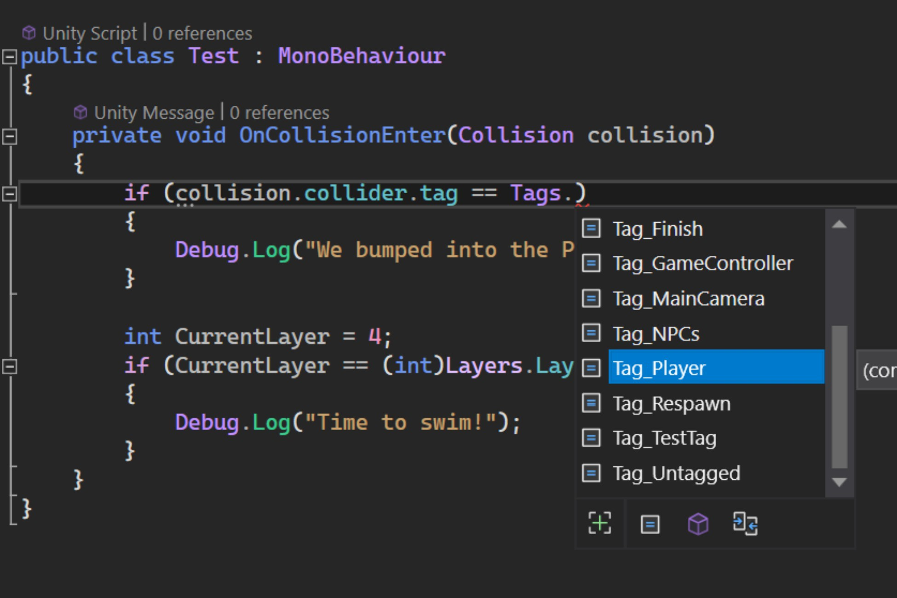

# Tags and Layers Generator Tool for Unity

Tags and Layers Generator Tool in which you can reference easily in code and employ type safety to help you avoid hardcoding your layers and tags. With VS Code or Visual Studio, intellisense will allow you to easily look up which layer or tag without having to jump in and out of the editor for sanity checks.

<p align="center">
    
</p>

The generation of these types can be easily invoked via the editor tool or left with Passively Generate Scripts turned on (which will regenerate the next time the Unity Editor needs to update i.e. When play mode is enabled, scripts have been edited or the Unity Window regains focus from tabbing back in.

<p align="center">
    
</p>

The only purpose of this tool is to help avoid being error prone to the old annoying bugs of mispell or mismatch with the bonus of not having to always remember what layer or what tag it was you were comparing or working with. Especially when updating or changing tags, regenerating will allow you to go see where abouts in code that you will need to fix straight away as opposed to wondering why 

```csharp
// Layer BossEnemy is now called `SpecialBossEnemyFireThingyBigDamage`
// Check will now silentely fail due to hard coding the string if we change 
// the layer name in the unity editor.
if(collision.collider.tag == "BossEnemy") 
{
    Debug.Log("We've hit the boss enemy");
}

// When we change the tag name again to something like `FireBoss`, 
// this line will flag up and not compile
if(collision.collider.tag == Tags.SpecialBossEnemyFireThingyBigDamage) { }

```

Yes, you can manage your own const strings and ints or enums but, then you'd have to update those too!

## Installation
Installation is as easy as downloading and importing the [unitypackage](https://github.com/North-Metal-Creative-UK/TagsAndLayersGenerator/releases/tag/v1.0.0) within your project. 

To use, once imported, you will need to go to the top of the Unity Editor Window and click on 
`Tools -> NorthMetalCreative -> Tags and Layers Generator` to spawn the editor window.

<p align="center">
    
</p>

The usage of the tool is self explanatory from the tool tips on the buttons provided.

<p align="center">
    
</p>

Within the editor tool, is a preview of the current state of what has been mapped in code in its current generated state in comparison to the tags and layers you have created.

<p align="center">
    
</p>

### License
Free - under the [MIT License](License.txt). 
You are also welcome to suggest changes or extend this ultra small editor tool :)